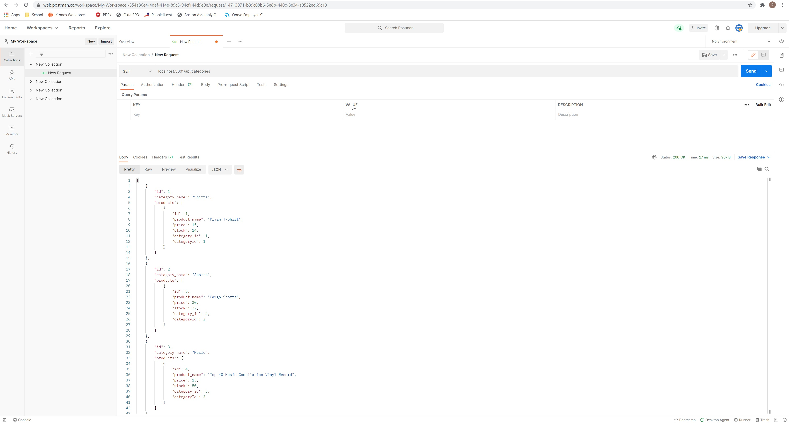

# EcommerceBE

# CRUD ORM of a E Commerce back end 

This application has a databse that can be manipulated via postman with POST, PUT GET, & DELETE. Will have belongsto, hasmany, belongstomany sequalize methods. 

Internet retail, also known as e-commerce, is the largest sector of the electronics industry, generating an estimated $29 trillion in 2019. E-commerce platforms like Shopify and WooCommerce provide a suite of services to businesses of all sizes. Due to their prevalence, understanding the fundamental architecture of these platforms will benefit you as a full-stack web developer.
Build the back end for an e-commerce site by modifying starter code. Configure a working Express.js API to use Sequelize to interact with a MySQL database.

## Picture of POSTMAN GET category table.

## Picture of POSTMAN GET product table.

# Link to Github repo
[Github repo](https://github.com/pfdemarco/EcommerceBE)

# Link to video
[Video](https://github.com/pfdemarco/EcommerceBE/blob/main/PDeMarco.mp4)

## License
[License](LICENSE)